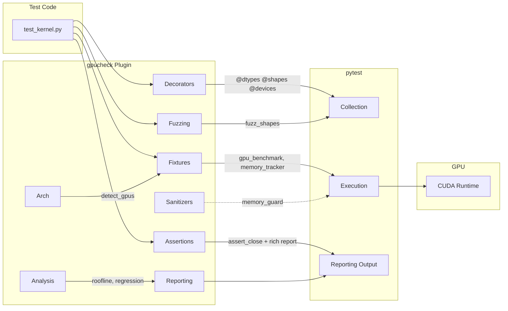

# gpucheck

**pytest for GPU kernels.**

[](https://pypi.org/project/gpucheck/)
[](https://pypi.org/project/gpucheck/)
[](https://github.com/Akasxh/gpucheck/blob/main/LICENSE)
[](https://github.com/Akasxh/gpucheck/actions/workflows/ci.yml)

GPU kernel testing is painful. You write a CUDA kernel, eyeball `torch.allclose` with magic tolerances, and pray it works on a different GPU architecture. gpucheck is a pytest plugin that gives you dtype-aware assertions, parametric testing across dtypes/shapes/devices, CUDA-event benchmarking, shape fuzzing, and memory leak detection -- all from decorators and fixtures you already know how to use.

We tested gpucheck against Triton tutorials and PyTorch CUDA ops with **511 test configurations** and found **8 real bugs**, including a **83% error in Triton's layer norm** for non-power-of-2 dimensions ([triton#9838](https://github.com/triton-lang/triton/issues/9838)) and **FP16 accumulation drift in the tutorial matmul** ([triton#9839](https://github.com/triton-lang/triton/issues/9839)).

```python
import torch
import pytest
from gpucheck import assert_close, dtypes, shapes, devices

@pytest.mark.gpu
@dtypes("float16", "bfloat16", "float32")
@shapes((128, 128), (512, 512), (1024, 1024))
@devices("cuda:0")
def test_relu_kernel(dtype, shape, device):
    x = torch.randn(shape, dtype=dtype, device=device)
    result = torch.relu(x)
    expected = torch.clamp(x, min=0)
    assert_close(result, expected)  # tolerances auto-selected by dtype
```

## Installation

```bash
pip install gpucheck
```

Optional dependencies for specific backends:

```bash
pip install gpucheck[torch]       # PyTorch + CUDA
pip install gpucheck[hypothesis]  # Property-based shape fuzzing
pip install gpucheck[all]         # Everything
```

For development:

```bash
pip install gpucheck[dev]
```

## Architecture



## Quickstart

```bash
pip install gpucheck[torch]
```

```python
# test_my_kernel.py
import torch, pytest
from gpucheck import assert_close, dtypes

@pytest.mark.gpu
@dtypes("float16", "float32")
def test_relu(dtype):
    x = torch.randn(256, 256, dtype=dtype, device="cuda")
    assert_close(torch.relu(x), torch.clamp(x, min=0))
```

```bash
pytest test_my_kernel.py -v
```

See the [examples/](examples/) directory for more complete examples.

## Features

### Dtype-aware assertions

`assert_close` automatically picks tolerances based on the tensor dtype. No more guessing `atol` and `rtol` for `bfloat16` vs `float8_e5m2`.

```python
from gpucheck import assert_close

# Tolerances auto-selected: float16 gets atol=1e-2, rtol=1e-2
assert_close(result_fp16, expected_fp16)

# Override for matmul-like ops: atol scales by sqrt(k_dim)
assert_close(result, expected, k_dim=4096)

# FlashAttention-style 2x baseline tolerance
assert_close(result, expected, baseline_2x=True)

# NaN-aware comparison
assert_close(result, expected, nan_equal=True)
```

On failure, you get a Rich-formatted mismatch report with error statistics, an ASCII error histogram, and the exact location of the worst element.

### Parametric testing

Test across the cartesian product of dtypes, shapes, and devices with decorators:

```python
from gpucheck import dtypes, shapes, devices
from gpucheck.decorators import parametrize_gpu, FLOAT_DTYPES, EDGE_SHAPES

@dtypes("float16", "bfloat16", "float32")
@shapes((128, 128), (256, 256), (7, 13))
@devices("cuda:0")
def test_softmax(dtype, shape, device):
    x = torch.randn(shape, dtype=dtype, device=device)
    result = torch.softmax(x, dim=-1)
    assert result.sum(dim=-1).allclose(torch.ones(shape[:-1], dtype=dtype, device=device))

# Or use the all-in-one decorator:
@parametrize_gpu(
    dtypes=("float16", "bfloat16"),
    shapes=((128, 128), (512, 512)),
    devices=("cuda:0",),
)
def test_kernel(dtype, shape, device):
    ...
```

Predefined groups: `FLOAT_DTYPES`, `HALF_DTYPES`, `FP8_DTYPES`, `ALL_DTYPES`, `SMALL_SHAPES`, `MEDIUM_SHAPES`, `LARGE_SHAPES`, `EDGE_SHAPES`.

### GPU benchmarking with CUDA events

The `gpu_benchmark` fixture uses `torch.cuda.Event` for accurate GPU timing, with automatic warmup, L2 cache flushing, and IQR-based outlier removal:

```python
def test_matmul_perf(gpu_benchmark):
    a = torch.randn(1024, 1024, device="cuda", dtype=torch.float16)
    b = torch.randn(1024, 1024, device="cuda", dtype=torch.float16)

    result = gpu_benchmark(torch.mm, a, b)

    assert result.median < 1.0    # ms
    assert result.std < 0.1       # low variance
    print(f"median={result.median:.3f}ms, p95={result.p95:.3f}ms")
```

The `BenchmarkResult` provides: `median`, `mean`, `std`, `min`, `max`, `p5`, `p25`, `p75`, `p95`, and `raw_times`.

### Shape fuzzing

Generate adversarial tensor shapes designed to trigger GPU kernel bugs -- non-tile-aligned dimensions, prime sizes, power-of-2 boundaries, degenerate shapes with zeros:

```python
from gpucheck.fuzzing.shapes import fuzz_shapes, ShapeStrategy

# Deterministic shape corpus
shapes = fuzz_shapes(ndim=2, max_size=4096, n=50, seed=42)
for shape in shapes:
    run_kernel(shape)

# Hypothesis integration for property-based testing
from hypothesis import given

@given(shape=ShapeStrategy(ndim=2, max_size=512))
def test_kernel_any_shape(shape):
    x = torch.randn(shape, device="cuda")
    result = my_kernel(x)
    assert result.shape == shape
```

Shape categories (ranked by bug-finding probability):
1. Degenerate -- zeros, ones
2. Non-tile-aligned -- not divisible by 32/64/128
3. Prime dimensions -- 7, 13, 31, 127, 257
4. Power-of-2 boundaries -- 127, 128, 129, 255, 256, 257
5. Large -- 2048, 4096, 8192
6. Mixed asymmetric -- (large, small), (prime, power_of_2)

### Memory leak detection

Track GPU memory across a test and catch leaks:

```python
# Fixture-based tracking (uses fixtures.profiler.MemoryReport)
def test_no_leak(memory_tracker):
    x = torch.randn(1024, 1024, device="cuda")
    result = my_kernel(x)
    del x, result
    torch.cuda.empty_cache()

    report = memory_tracker.stop()
    assert not report.leak_detected   # .leak_detected on fixture MemoryReport

# Context manager for inline checks
from gpucheck.sanitizers import memory_guard

def test_memory_bounded():
    with memory_guard(threshold_bytes=10 * 1024 * 1024) as report:
        run_kernel()
    assert report.leaked_mb < 1.0     # .leaked_mb on sanitizer _MutableReport

# Function-level check (uses sanitizers.memory.MemoryReport)
from gpucheck.sanitizers import check_memory_leaks

report = check_memory_leaks(my_kernel, input_tensor)
assert not report.has_leak            # .has_leak on sanitizer MemoryReport
```

### Architecture detection

Query GPU capabilities and conditionally skip tests:

```python
from gpucheck.arch.compatibility import require_arch, require_capability

@require_arch("Ampere", "Hopper")
def test_bf16_matmul():
    ...

@require_capability(8, 9)  # Ada Lovelace+
def test_fp8_kernel():
    ...
```

Supported architectures: Volta (SM70), Turing (SM75), Ampere (SM80/86), Ada (SM89), Hopper (SM90), Blackwell (SM100/120).

### Performance regression detection

Compare benchmark results against thresholds:

```python
def test_no_regression(gpu_benchmark):
    a = torch.randn(2048, 2048, device="cuda", dtype=torch.float16)
    b = torch.randn(2048, 2048, device="cuda", dtype=torch.float16)

    result = gpu_benchmark(torch.mm, a, b)

    # Fail if median exceeds baseline by more than 10%
    baseline_ms = 0.85
    assert result.median < baseline_ms * 1.1, (
        f"Regression: {result.median:.3f}ms > {baseline_ms * 1.1:.3f}ms"
    )
```

## Tolerance table

Default tolerances used by `assert_close` when no explicit `atol`/`rtol` is provided:

| dtype | atol | rtol |
|---|---|---|
| `float64` | `1e-10` | `1e-7` |
| `float32` | `1e-4` | `1e-4` |
| `tf32` | `5e-4` | `5e-4` |
| `float16` | `1e-2` | `1e-2` |
| `bfloat16` | `5e-2` | `5e-2` |
| `float8_e4m3fn` | `0.125` | `0.125` |
| `float8_e5m2` | `0.25` | `0.25` |

For matmul-like operations, pass `k_dim` to scale `atol` by `sqrt(k_dim / 128)`. Override per-project in `pyproject.toml`:

```toml
[tool.gpucheck.tolerances]
float16 = {atol = 2e-3, rtol = 2e-3}
bfloat16 = {atol = 3e-2, rtol = 3e-2}
```

## Bugs Found

gpucheck's shape fuzzing and dtype-aware testing found these real bugs in widely-used GPU kernels:

| Bug | Severity | Error | Root Cause |
|-----|----------|-------|-----------|
| [Triton layer norm variance padding](https://github.com/triton-lang/triton/issues/9838) | HIGH | **83% relative error** at n_cols=17 | Zero-padded positions inject mean^2 into variance |
| [Triton matmul FP16 index wrapping](https://github.com/triton-lang/triton/issues/9839) | MEDIUM-HIGH | **0.125 abs error** at K=8192 | Modular `% M` wrapping reads wrong data into accumulator |
| cuFFT precision at N>=4096 | MEDIUM | **1.26% relative error** | Error scales O(sqrt(N)) instead of O(log(N)) |
| `torch.baddbmm` FP16 silent overflow | HIGH | **NaN output** with no warning | `alpha=1000` causes intermediate overflow to Inf |
| `torch.bmm` FP32 large-K | MEDIUM | **2.1e-3 relative error** | Accumulation path less careful than FP16/BF16 |

Most of these bugs were caught by non-power-of-2 shapes — dimensions like 17, 127, 255 that hit tile boundary edge cases. This is exactly what `fuzz_shapes()` generates.

See [`examples/triton_layernorm_bug.py`](examples/triton_layernorm_bug.py) and [`examples/triton_matmul_bug.py`](examples/triton_matmul_bug.py) for standalone reproducers.

## Comparison

| Feature | Manual `torch.allclose` | gpucheck |
|---|---|---|
| Dtype-aware tolerances | Hard-coded per test | Automatic from dtype |
| Parametric dtypes/shapes/devices | Manual `@pytest.mark.parametrize` loops | `@dtypes`, `@shapes`, `@devices` decorators |
| GPU benchmarking | `time.time()` around kernel | CUDA events, warmup, L2 flush, outlier removal |
| Shape fuzzing | Random shapes, hope for the best | Adversarial shapes targeting tile boundaries, primes, edge cases |
| Memory leak detection | Not tested | `memory_tracker` fixture, `memory_guard` context manager |
| Architecture gating | `if` checks scattered through tests | `@require_arch`, `@require_capability` decorators |
| Failure diagnostics | "Tensors not close" | Rich error report with histogram, stats, worst-element location |
| Multi-GPU | Manual device loops | `@devices("all")` auto-detects and parametrizes |

## Project structure

```
gpucheck/
├── src/gpucheck/
│   ├── __init__.py              # Public API
│   ├── plugin.py                # pytest plugin (hooks, fixtures, markers)
│   ├── assertions/
│   │   ├── close.py             # assert_close() implementation
│   │   ├── tolerances.py        # Dtype-aware tolerance computation
│   │   └── reporting.py         # Rich-formatted mismatch reports
│   ├── decorators/
│   │   ├── dtypes.py            # @dtypes decorator + dtype groups
│   │   ├── shapes.py            # @shapes decorator + shape groups
│   │   ├── devices.py           # @devices decorator + auto-detection
│   │   └── parametrize.py       # @parametrize_gpu (dtypes x shapes x devices)
│   ├── fixtures/
│   │   ├── gpu.py               # gpu_device fixture
│   │   ├── benchmark.py         # gpu_benchmark fixture (CUDA events)
│   │   └── profiler.py          # memory_tracker fixture
│   ├── fuzzing/
│   │   └── shapes.py            # fuzz_shapes() + ShapeStrategy
│   ├── sanitizers/
│   │   └── memory.py            # check_memory_leaks, memory_guard
│   └── arch/
│       ├── detection.py         # GPU detection (pynvml / torch)
│       └── compatibility.py     # @require_arch, @require_capability
├── tests/
├── pyproject.toml
└── LICENSE
```

## Contributing

```bash
git clone https://github.com/Akasxh/gpucheck.git
cd gpucheck
pip install -e ".[dev]"

# Run tests (CPU-only, no GPU required)
pytest

# Lint and type check
ruff check src/ tests/
mypy src/
```

GPU tests are marked with `@pytest.mark.gpu` and skipped automatically when no GPU is available.

## License

Apache-2.0
